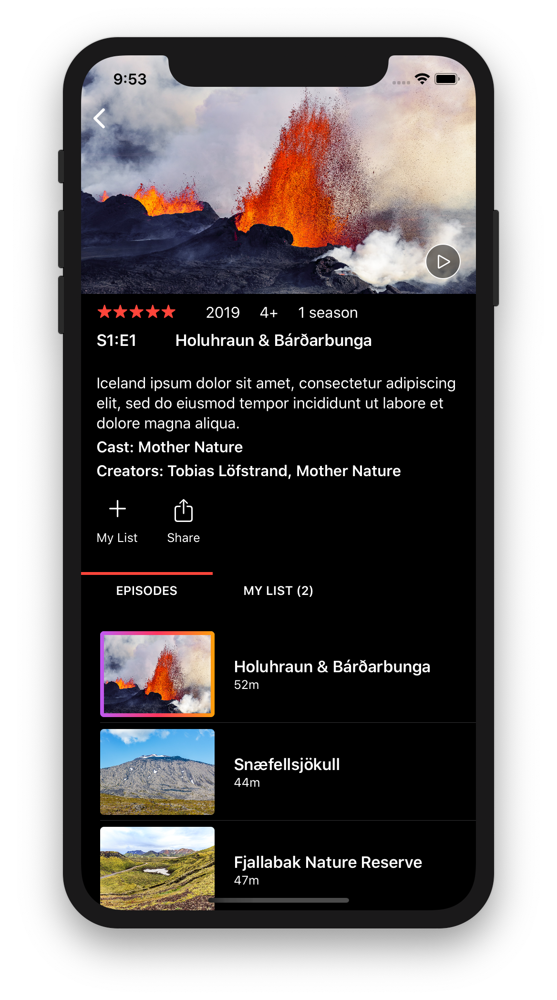

# SwiftyVistas

A simple SwiftUI sample code app, ported from the [FlexyVistas](https://github.com/tolo/InterfaCSS/tree/develop/Samples/FlexyVistas) 
sample from [InterfaCSS 2.0](https://github.com/tolo/InterfaCSS/tree/develop), which in turn was inspired by the 
example in the [Ray Wenderlich Yoga Turorial](https://www.raywenderlich.com/530-yoga-tutorial-using-a-cross-platform-layout-engine).

The intent of this sample app is to use it to try out (and showcase) the capabilities of the newly released SwiftUI and Combine frameworks. 
The first beta versions released during WWDC 2019 were somewhat limited, and as upcoming beta versions are released, the plan is to update this 
sample to make use of the new functionality.    

